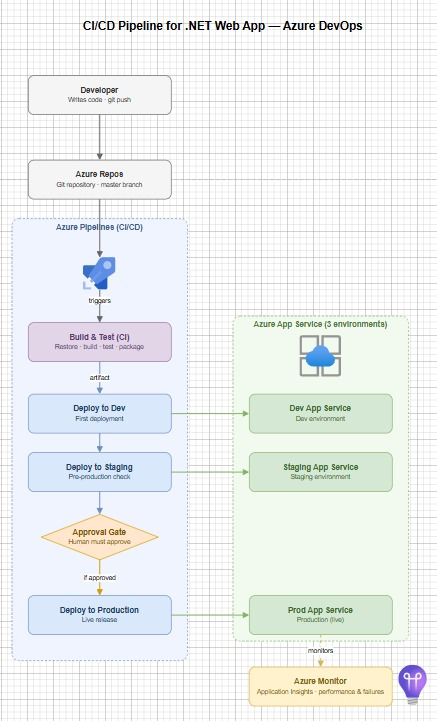
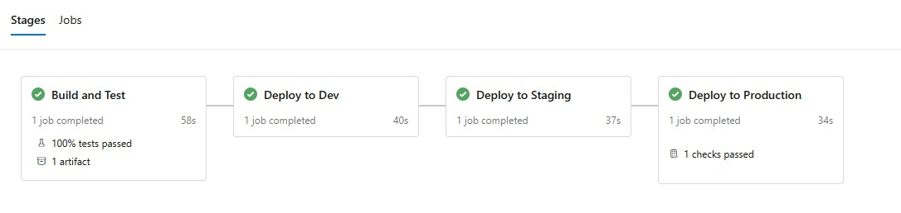
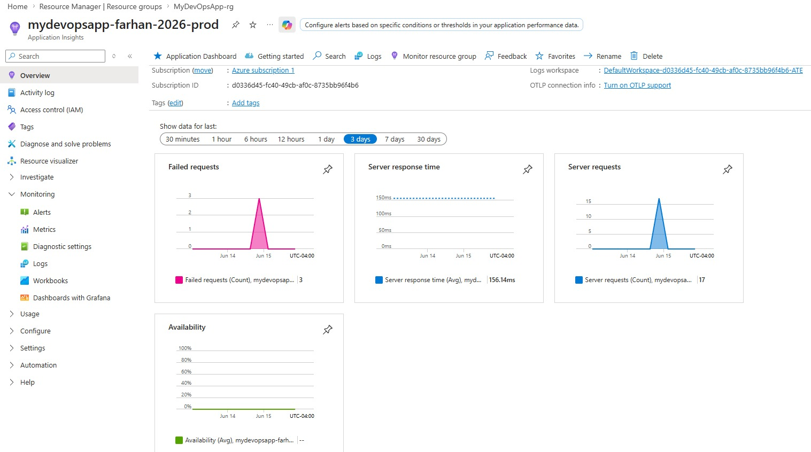

# Azure DevOps CI/CD Pipeline for a .NET Web Application

A **production-grade CI/CD pipeline** built with **Azure DevOps** that automatically builds, tests, and deploys a .NET web application across **three isolated environments** (Dev → Staging → Production), with **release governance** through a manual approval gate guarding production and **Azure Monitor** providing live observability.

> Designed and implemented to demonstrate industry-standard DevOps practices: pipeline-as-code, a multi-environment deployment strategy, release governance, and application observability.

---

## Architecture



The pipeline is defined as code in a single `azure-pipelines.yml` file and runs automatically on every push to the `master` branch:

1. **Build & Test (CI)** — restores dependencies, builds the app, runs unit tests, and packages the output as an artifact.
2. **Deploy to Dev** — deploys the artifact to the Dev App Service.
3. **Deploy to Staging** — promotes the same artifact to the Staging App Service.
4. **Approval Gate** — pauses the pipeline and waits for manual human approval.
5. **Deploy to Production** — after approval, deploys to the Production App Service.
6. **Azure Monitor** — Application Insights tracks performance, traffic, and failures on the live app.

A core principle applied throughout is **build once, deploy everywhere**: the application is packaged a single time, and that exact artifact is promoted through every environment — eliminating environment drift and guaranteeing that what was tested is what reaches production.

---

## Tech Stack & Skills Demonstrated

| Area | Tools / Concepts |
|------|------------------|
| **Language / Framework** | C#, .NET 10, ASP.NET Core (Razor Pages) |
| **Testing** | xUnit (unit testing) |
| **Source Control** | Git, Azure Repos (mirrored to GitHub) |
| **CI/CD** | Azure Pipelines (multi-stage YAML, pipeline-as-code) |
| **Hosting** | Azure App Service (Linux) |
| **Environments** | Dev, Staging, Production (isolated App Services) |
| **Governance** | Manual approval gates on production deployments |
| **Monitoring** | Azure Monitor / Application Insights |
| **Security** | Workload Identity Federation (service connection) |

**Key concepts applied:** Continuous Integration, Continuous Deployment, pipeline-as-code, build artifacts, multi-stage deployments, environment promotion, deployment approvals, and observability.

---

## Pipeline Overview

The entire workflow lives in [`azure-pipelines.yml`](azure-pipelines.yml). At a high level:

- **Trigger:** runs automatically on every commit to `master`.
- **Stage 1 – Build & Test:** `dotnet restore` → `dotnet build` → `dotnet test` → publish artifact.
- **Stages 2–4 – Deploy:** the artifact is promoted to Dev, then Staging, then Production.
- **Approval check:** release governance enforced at the *Production* environment in Azure DevOps — deployment cannot proceed until a designated approver signs off.

### Screenshots

**Successful multi-stage pipeline run**



**Azure Monitor dashboard**



---

## Project Structure

```
.
├── MyWebApp/                 # The ASP.NET Core web application
│   ├── Pages/                # Razor Pages (UI)
│   ├── Calculator.cs         # Sample business logic (unit tested)
│   └── Program.cs            # App entry point
├── MyWebApp.Tests/           # xUnit test project
│   └── UnitTest1.cs          # Unit tests for the application
├── azure-pipelines.yml       # The CI/CD pipeline definition (pipeline-as-code)
├── nuget.config              # Package source configuration
├── .gitignore                # Excludes build output (bin/obj) from source control
└── MyDevOpsApp.slnx          # Solution file
```

---

## How to Run It Yourself

### Prerequisites

- [.NET 10 SDK](https://dotnet.microsoft.com/download)
- An Azure DevOps organization
- An Azure subscription with App Service provisioned

### 1. Clone the repository

```bash
git clone https://github.com/farhansohail1501/azure-devops-cicd-pipeline.git
cd azure-devops-cicd-pipeline
```

### 2. Run the application locally

```bash
dotnet run --project MyWebApp
```

Then open the `http://localhost:<port>` address shown in the terminal.

### 3. Run the unit tests

```bash
dotnet test
```

### 4. Set up the pipeline (Azure DevOps)

1. Import or push this repository into **Azure Repos**.
2. Create an **Azure Resource Manager service connection** to your Azure subscription.
3. Create three **Azure App Services** (Linux, .NET) — one each for Dev, Staging, and Production.
4. Update the `webAppName` and service connection values in `azure-pipelines.yml` to match your resources.
5. Create a **new pipeline** pointing at `azure-pipelines.yml`.
6. In **Environments**, add an **Approval** check to the `Production` environment.
7. Push a commit and watch the pipeline build, test, and deploy across all three environments.

---

## Key Takeaways

- Authored **multi-stage pipelines as code** in YAML, applying pipeline-as-code over click-based configuration for versioning and repeatability.
- Implemented the **build-once-deploy-everywhere** principle using build artifacts to eliminate environment drift.
- Designed a **multi-environment deployment strategy** (Dev/Staging/Production) with safe, sequential release promotion.
- Enforced **release governance** with approval gates to require human sign-off before production releases.
- Integrated **Azure Monitor / Application Insights** for post-deployment observability of performance, traffic, and failures.
- Diagnosed and resolved **real pipeline issues** — including package source authentication, Git history conflicts, and service-connection configuration within deployment jobs.

---

## Author

**Farhan Sohail**
[LinkedIn](https://www.linkedin.com/in/YOUR-LINKEDIN-HERE)
